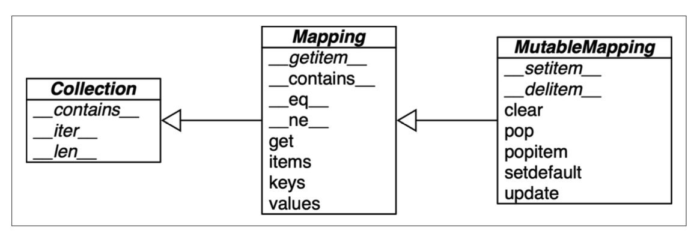

# Ch 3. 字典与集合

---

## 现代 dict 语法

- 字典推导式（dict comprehensions）
```python
dial_codes = [(880, 'Bangladesh'), (55, 'Brazil'), (86, 'China')]
country_dial = {country: code for code, country in dial_codes}
# 带过滤条件
{code: country.upper() for country, code in sorted(country_dial.items()) if code < 70}
```

- 映射解包（`**`）用于解包字典
```python
# 函数调用中可使用多个 **（要求键为字符串且不重复）
dump(**{'x': 1}, y=2, **{'z': 3})  # {'x': 1, 'y': 2, 'z': 3}
# dict 字面量中可多次使用 **，后者覆盖前者
{'a': 0, **{'x': 1}, 'y': 2, **{'z': 3, 'x': 4}}  # x 最终为 4
```

- 用 `|` 合并映射

```python
d1 = {'a': 1, 'b': 3}
d2 = {'a': 2, 'b': 4, 'c': 6}
d1 | d2    # 创建新映射，右边优先：{'a': 2, 'b': 4, 'c': 6}
d1 |= d2   # 原地更新 d1
```

---

## 模式匹配（Python 3.10+）
映射模式匹配类似 dict 字面量，**部分匹配即可成功**（满足case要求即可）。

```python
def get_creators(record: dict) -> list:
    match record:
        case {'type': 'book', 'api': 2, 'authors': [*names]}:
        # [*names] 是序列模式嵌套进来，把 authors 列表里所有元素捕获到 names。
            return names
        case {'type': 'book', 'api': 1, 'author': name}:
            return [name]
        case {'type': 'book'}:
            raise ValueError(f"Invalid 'book' record: {record!r}")
        case {'type': 'movie', 'director': name}:
            return [name]
        case _:
            raise ValueError(f'Invalid record: {record!r}')
```
- 键顺序无关，OrderedDict 也同样匹配
- 模式匹配使用 `d.get(key, sentinel)`，不会触发 `__missing__`。
  - （`__missing__` 只在 `d[key]` 时触发，`d.get(key)` 不触发）
- 可用 `**details` 捕获剩余键值（必须放最后，`**_` 不允许）

```python
match food:
    case {'category': 'ice cream', **details}:
        print(f'Ice cream details: {details}')
```

---

## 标准映射 API

### 类型检查
```python
isinstance(my_dict, abc.Mapping)        # ✅ 推荐
isinstance(my_dict, dict)               # ❌ 太严格
```
用 abc.Mapping 的好处是：任何"像字典的东西"（OrderedDict、UserDict、自定义映射）都能通过检查，而不只是 dict 本身。


### hashable条件
- 有 `__hash__()` 方法，且生命周期内哈希值不变
- 有 `__eq__()` 方法
- 相等的对象必须有相同哈希码

| 类型                           | 是否可哈希                |
| ------------------------------ | ------------------------- |
| `int`, `float`, `str`, `bytes` | ✅                         |
| `tuple`                        | ✅（仅当所有元素可哈希时） |
| `frozenset`                    | ✅                         |
| `list`, `dict`, `set`          | ❌                         |

```python
hash((1, 2, (30, 40)))    # ✅
hash((1, 2, [30, 40]))    # ❌ TypeError: unhashable type: 'list'
hash((1, 2, frozenset([30, 40])))  # ✅
```

> 哈希码在不同 Python 版本、机器架构间可能不同（含安全盐值）。

- If an object implements a custom `__eq__()` that takes into account its internal state, it will be hashable only if its `__hash__()` always returns the same hash code.
- In practice, this requires that `__eq__()` and `__hash__()` only take into account instance attributes that never change during the life of the object.

**update() 的鸭子类型**
- `d.update(m)`不要求 m 一定是 dict，只要"像映射"就行
```python
d.update({'a': 1})                    # 传映射
d.update([('a', 1), ('b', 2)])        # 传 (key, value) 可迭代
d.update(a=1, b=2)                    # 传关键字参数
```
- 先看有没有 keys() 方法，有就当映射处理，没有就当 (k, v) 对迭代——这就是鸭子类型。

### `setdefault` 高效更新

**问题**：用 `d.get(k, [])` 更新可变值需要两次查找：

- `setdefault` 一次查找完成：键存在就返回已有的值，不存在就先设为 [] 再返回
```python
index.setdefault(word, []).append(location)
# 等价于：
# if word not in index:
#     index[word] = []
# index[word].append(location)
```

---

## 缺失键的自动处理

### `defaultdict`

```python
import collections
index = collections.defaultdict(list)  # default_factory = list
index['new-key'].append(location)      # 自动创建空列表
```

- `default_factory` 只在 `d[k]` 时触发，`d.get(k)` 不触发。
  - default_factory 只服务于 `__getitem__`
- default_factory 必须是可调用对象

### `__missing__` 方法

`dict` 的子类可定义 `__missing__`，在 `d[k]` 找不到键时被调用（`d.get(k)` 不调用）。

```python
class StrKeyDict0(dict):
    def __missing__(self, key):
        if isinstance(key, str):   # 防止无限递归！
            raise KeyError(key)
        return self[str(key)]      # 将非字符串键转为字符串再查找

    def get(self, key, default=None):
        try:
            return self[key]       # 委托给 __getitem__，触发 __missing__
        except KeyError:
            return default

    def __contains__(self, key):
        return key in self.keys() or str(key) in self.keys()
```

- **`isinstance(key, str)` 检查的必要性**：防止 `str(k)` 也不存在时的无限递归。
- 用 `key in self.keys()` 而不是 `key in self`，是为了避免递归调用 `__contains__`.


### `__missing__` 触发规则总结

| 子类来源                                            | `d[k]` | `d.get(k)` | `k in d` |
| --------------------------------------------------- | ------ | ---------- | -------- |
| `dict` subclass                                     | ✅      | ❌          | ❌        |
| `collections.UserDict` subclass                     | ✅      | ✅          | ❌        |
| `abc.Mapping`（`__getitem__` 不调用 `__missing__`） | ❌      | ❌          | ❌        |
| `abc.Mapping`（`__getitem__` 调用 `__missing__`）   | ✅      | ✅          | ✅        |

---

## dict 的变体

### `collections.OrderedDict`

现在 `dict` 已保持插入顺序（Python 3.7+），`OrderedDict` 的剩余独特之处：
- `==` 比较时考虑键的顺序
- `popitem()` 支持参数指定弹出首尾
- `move_to_end()` 高效重排元素
- 适合频繁重排操作（如 LRU 缓存）

### `collections.ChainMap`
把多个字典串成一个来查，找到就停
```python
from collections import ChainMap
d1 = dict(a=1, b=3)
d2 = dict(a=2, b=4, c=6)
chain = ChainMap(d1, d2)
chain['a']  # 1（来自 d1）
chain['c']  # 6（来自 d2）
# 更新只影响第一个映射
chain['c'] = -1  # d1 变为 {'a':1, 'b':3, 'c':-1}，d2 不变
# 经典用例：模拟 Python 变量查找
import builtins
pylookup = ChainMap(locals(), globals(), vars(builtins))
```

### `collections.Counter`
专门用来计数
```python
ct = collections.Counter('abracadabra')
# Counter({'a': 5, 'b': 2, 'r': 2, 'c': 1, 'd': 1})
ct.update('aaaaazzz')
ct.most_common(3)  # [('a', 10), ('z', 3), ('b', 2)]
```

支持 `+`、`-` 运算符合并计数，可当作多重集使用。

### `shelve.Shelf`
持久化的字典，数据存到磁盘（用 pickle 序列化）
```python
import shelve
with shelve.open('mydata') as db:
    db['key'] = {'some': 'data'}   # 自动保存到文件
```
限制：键必须是字符串，值必须能被 pickle 序列化。

### `UserDict`（推荐用于自定义映射）

优先继承 `UserDict` 而非 `dict`，原因：dict 是 C 实现的，有些快捷路径会绕过你自定义的方法，导致行为不一致。UserDict 用 `self.data`（普通 dict）存数据，所有方法都走 Python 层，行为可预期。

```python
import collections
# 继承 dict：需要自己写 get、__contains__，还要小心递归
class StrKeyDict0(dict):
    def __missing__(self, key): ...
    def get(self, key, default=None): ...   # 必须自己写
    def __contains__(self, key): ...        # 必须自己写
# 继承 UserDict：只需写三个方法，其余全部继承
class StrKeyDict(collections.UserDict):
    def __missing__(self, key):
        if isinstance(key, str):
            raise KeyError(key)
        return self[str(key)]
    def __contains__(self, key):
        return str(key) in self.data    # 直接访问内部 dict
    def __setitem__(self, key, item):
        self.data[str(key)] = item      # 存储时转为字符串键
```
- 额外好处：`__setitem__` 在存入时就把键转成 str，所以字典里永远不会有非字符串键，`__contains__` 就不需要两次检查了。
---

## Immutable mappings

```python
from types import MappingProxyType

d = {1: 'A'}
d_proxy = MappingProxyType(d)

d_proxy[1]       # 'A'   ✅ 可读
d_proxy[2] = 'x' # ❌ TypeError
d[2] = 'B'
d_proxy          # 动态代理，不是拷贝，原字典变了它也跟着变
```
实际用法：对外暴露只读视图，内部保留可写的原字典：

```python
class Board:
    def __init__(self):
        self._pins = {13: PinObject()}          # 私有，可写
        self.pins = MappingProxyType(self._pins) # 公开，只读

board = Board()
board.pins[13]      # ✅ 可以查
board.pins[14] = x  # ❌ 报错，防止误操作
```
把可写字典包装成只读对外暴露。

---

## Dictionary Views
- 视图就是字典内部数据的只读动态窗口，不复制数据。
- `.keys()`、`.values()`、`.items()` 返回视图对象，是内部数据结构的**只读动态代理**（不复制数据）。
- 动态体现在原字典变了，视图自动跟着变.
```python
d = dict(a=10, b=20, c=30)
values = d.values()
len(values)       # 3
list(values)      # [10, 20, 30]
reversed(values)  # 支持反向迭代
values[0]         # ❌ 不支持下标

d['z'] = 99
values            # dict_values([10, 20, 30, 99])  实时更新
```
|                          | `dict_values` | `dict_keys` | `dict_items`    |
| ------------------------ | ------------- | ----------- | --------------- |
| 迭代、len                | ✅             | ✅           | ✅               |
| 集合运算（`&`、`\|` 等） | ❌             | ✅           | ✅（值需可哈希） |
```python
d1 = dict(a=1, b=2)
d2 = dict(b=20, c=30)
d1.keys() & d2.keys()   # {'b'}  交集
d1.keys() | d2.keys()   # {'a', 'b', 'c'}  并集
```
- The dict_values class implements only the `__len__`, `__iter__`, and `__reversed__` special methods. In addition to these methods, `dict_keys` and `dict_items` implement several set methods
---

## dict 的实际影响

- **键必须可哈希**
- **键访问极快**：通过哈希码直接定位
- **键顺序保留**：3.7 成为语言规范
- **内存开销较大**：哈希表需保持至少 1/3 空行以维持效率
- **尽量在 `__init__` 内定义所有实例属性**：Python 3.3+ 同类实例共享哈希表，`__init__` 外新增属性会导致该实例单独创建哈希表，内存优化失效。

---

## Set / frozenset
- 核心特性是元素唯一，最直接的用途是去重
```python
# 去重
l = ['spam', 'spam', 'eggs', 'spam']
set(l)       # {'eggs', 'spam'}
# 保序去重（利用 dict 保留先出现的 key）
list(dict.fromkeys(l).keys())  # ['spam', 'eggs']
```

- **集合字面量**：`{1}`, `{1, 2}`
- `{}` 是空 dict，空集合必须用 `set()`
```python
# 字面量语法更快（使用 BUILD_SET 字节码，无需查找构造器）
{1, 2, 3}       # 推荐
set([1, 2, 3])  # 较慢
frozenset(range(10))  # frozenset 没有字面量语法，只能用构造器
```

### 集合运算

```python
a | b   # union
a & b   # intersection
a - b   # difference
a ^ b   # symmetric difference = a + b - a & b

# 实用示例：统计 needles 在 haystack 中出现的数量
found = len(needles & haystack)                          # 要求都是 set
found = len(set(needles).intersection(haystack))         # haystack 可以是任意可迭代
```

### 集合推导式

```python
from unicodedata import name
{chr(i) for i in range(32, 256) if 'SIGN' in name(chr(i), '')}
```

---

### 集合的实际影响

- 元素必须可哈希
- 成员测试极快（基于哈希表）
- 内存开销比数组大
- **元素顺序不可靠**：依赖插入顺序，且扩容时顺序可能改变

```python
# 带 = 的是原地修改版本
a &= b
a |= b
# 运算符要求两边都是set，但是方法可以接收任意可迭代对象
a.union(b, c, d)
a.intersection([1, 2, 3])
s.remove(e)   # 元素不存在 → KeyError
s.discard(e)  # 元素不存在 → 静默忽略，不报错
```
---

## dict 视图支持集合操作

`dict_keys` 和 `dict_items` 支持集合运算符：

```python
d1 = dict(a=1, b=2, c=3, d=4)
d2 = dict(b=20, d=40, e=50)
# 可以和set进行集合运算
d1.keys() & d2.keys()   # {'b', 'd'}
d1.keys() | {'a', 'e', 'i'}  # {'a', 'c', 'b', 'd', 'i', 'e'}
```
- `dict_items` 要求值可哈希才能用作集合（如list就不行）；
- `dict_keys` 始终可用（键必然可哈希）。

---

## 常用 dict 方法

| 方法                                  | 说明                                               |
| ------------------------------------- | -------------------------------------------------- |
| `d[k]`                                | 获取值，不存在则 `KeyError`（触发 `__missing__`）  |
| `d.get(k, default)`                   | 安全获取，不存在返回 default                       |
| `d.setdefault(k, [])`                 | 不存在则设置并返回默认值，一次查找                 |
| `d.update(m)`                         | 批量更新，支持映射/可迭代/(key,value)对/关键字参数 |
| `d.keys()` / `.values()` / `.items()` | 返回动态视图                                       |
| `d.pop(k, default)`                   | 删除并返回值                                       |
| `d \| d2`                             | 创建合并后的新 dict（Python 3.9+）                 |
| `d \|= d2`                            | 原地合并（Python 3.9+）                            |
