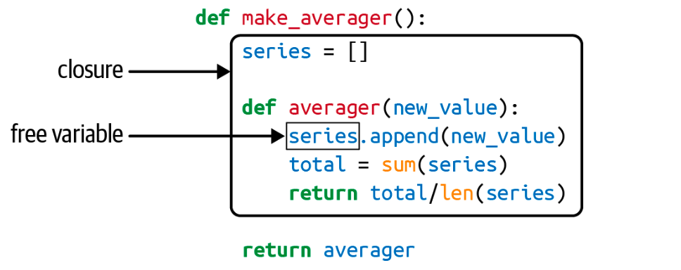
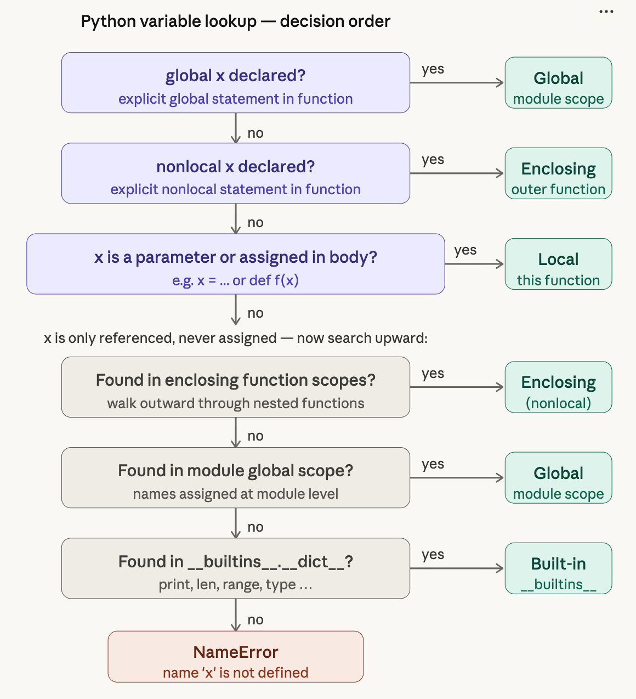

# Ch 9: Decorators and Closures
> 掌握装饰器需要理解闭包，理解闭包需要理解变量作用域和 `nonlocal`。

## 1. 装饰器基础

装饰器是一个可调用对象（callable）
- 接受一个函数作为参数，经过某种处理后，返回原函数或新函数。
- "装饰器是给函数"穿外套"的工具"
```python
@decorate
def target():
    print('running target()')

# 等价于：
def target():
    print('running target()')
target = decorate(target)
```
1. 装饰器是函数或其他可调用对象
2. 装饰器可以将被装饰函数替换为另一个函数
3. **装饰器在模块加载时（`import`）立即执行**，而非被装饰函数调用时

### 替换示例

```python
>>> def deco(func):
...     def inner():
...         print('running inner()')
...     return inner

>>> @deco
... def target():
...     print('running target()')

>>> target()       # 输出: running inner()
>>> target         # <function deco.<locals>.inner at 0x...>
```

---

## 装饰器的执行时机：导入时 vs 运行时
- 装饰器在函数被"定义"的瞬间执行
```python
registry = []

def register(func):
    print(f'running register({func})')  # 导入时就执行
    registry.append(func)
    return func

@register
def f1():
    print('running f1()')

@register
def f2():
    print('running f2()')
```

```python
>>> import registration
running register(<function f1 at 0x...>)   # 导入时立即执行
running register(<function f2 at 0x...>)   # 导入时立即执行
>>> registration.registry
[<function f1 at 0x...>, <function f2 at 0x...>]
```
| | import time（导入时）| runtime（运行时）|
|-------|---------|----------|
| 触发条件 | 模块被 import 或直接运行时 | 代码中显式调用函数时 |
| 发生了什么 | 装饰器本身被执行| 被装饰的函数体被执行 |

- **注册装饰器**的实际应用：将函数添加到中央注册表（如 URL 路由映射），装饰器返回原函数不变。
- 插件注册/自动发现机制: 框架（如 Flask）大量使用这种模式，导入模块 = 注册完毕，无需手动调用任何初始化函数。
- 实际项目中，通常是这样的结构：装饰器往往是通用工具，被设计成可以跨模块复用。
    ```
    myproject/
    ├── decorators.py      ← 定义装饰器
    ├── views.py           ← 应用装饰器
    └── models.py          ← 应用装饰器
    ```
- 典型的装饰器长这样：
    ```python
    def decorator(func):
        def inner(*args, **kwargs):   # 定义内层函数
            # ... 增强逻辑 ...
            return func(*args, **kwargs)
        return inner                  # 返回新函数替换原函数
    ```
---

## Variable Scope Rules

**赋值决定局部性**
```python
b = 6
def f2(a):
    print(a)
    print(b)   # ❌ UnboundLocalError!
    b = 9      # 这行让 Python 编译器将 b 视为局部变量
```

- Python 编译期（早于任何执行），发现 `b` 在函数内有赋值，将 `b` 判定为局部变量。
- 变量的局部/全局性质在整个函数体内不会改变。

### `global`

```python
b = 6
def f3(a):
    global b    # 明确告诉 Python：b 是全局变量
    print(a)    # 3
    print(b)    # 6
    b = 9       # 修改全局变量

>>> f3(3)
>>> b           # 9 ← 全局变量被修改了
```
- `global b` 的作用：强制编译器对这个函数里所有的 b 都用 `LOAD_GLOBAL` / `STORE_GLOBAL`。

---

## 闭包 (Closures)

**定义**：闭包是一个函数
- 它能访问既不是自己的局部变量、也不是全局变量的变量。（自由变量）
  - 保留了定义时存在的自由变量的绑定，使得在定义作用域不再可用时仍能使用这些变量。
- 这些变量来自定义它的那个外层函数的局部作用域
- 并且在外层函数已经返回后依然可以访问。

### 类实现 vs 闭包实现

```python
# 类实现
class Averager():
    def __init__(self):
        self.series = []

    def __call__(self, new_value):
        self.series.append(new_value)
        total = sum(self.series)
        return total / len(self.series)

# 闭包实现
def make_averager():
    series = []                    # 自由变量

    def averager(new_value):
        series.append(new_value)   # series 是闭包中的自由变量
        total = sum(series)
        return total / len(series)

    return averager

avg1 = make_averager()
avg2 = make_averager()   # avg1 和 avg2 的 series 完全独立
```

`make_averager()` 返回后，其局部作用域已消失，但 `averager` 通过闭包保留了对 `series` 的绑定。
- closure：是 averager 函数 + 它所捕获的外层变量 series 的整体
- free variable：series 对于 averager 来说，既不是参数，也不是在自身内部定义的，而是来自外层——这就是自由变量

**查看闭包内部**
正常情况下，函数返回后其局部变量会被销毁。但闭包打破了这个规则：Python 通过 `__closure__` 属性把自由变量"封存"在返回的函数对象里。
```python
>>> avg.__code__.co_varnames    # ('new_value', 'total')  局部变量的名字
>>> avg.__code__.co_freevars    # ('series',)             自由变量的名字
>>> avg.__closure__             # 自由变量的存储单元（cell）
(<cell at 0x107a44f78: list object at 0x107a91a48>,)
>>> avg.__closure__[0].cell_contents  # [10, 11, 15]      实际值
```
内存结构可以这样理解：
```
avg 函数对象
├── __code__         → 函数的字节码
├── __code__.co_varnames  → ('new_value', 'total')   局部变量
├── __code__.co_freevars  → ('series',)               自由变量名
└── __closure__      → [ cell → [10, 11, 12] ]        自由变量值
```

---

## `nonlocal`

**问题：对不可变类型的赋值会创建局部变量**
- 赋值导致count被认为是局部变量

```python
def make_averager():
    count = 0
    total = 0
    def averager(new_value):
        count += 1           # ❌ count += 1 等于 count = count + 1
        total += new_value   # ❌ 赋值使它们变成局部变量
        return total / count
    return averager
# UnboundLocalError: local variable 'count' referenced before assignment
```
**解决：`nonlocal`**
- 强制视为自由变量（即使有赋值操作）。
- 赋值时修改的是闭包里保存的绑定，而不是创建新的局部变量。
- `nonlocal` 填补了 Enclosing 层的写权限。在此之前，内层函数只能读外层变量，无法修改不可变类型的外层变量。
```python
def make_averager():
    count = 0
    total = 0

    def averager(new_value):
        nonlocal count, total   # 声明为自由变量
        count += 1
        total += new_value
        return total / count

    return averager
```

## 变量查找逻辑

1. 有 `global x` 声明 → 从模块全局作用域获取
   - 可变类型，可以直接修改，不能赋值
   - 不可变类型，不能赋值
2. 有 `nonlocal x` 声明 → 从最近的外层函数局部作用域获取
   - 可变类型，可以直接修改，不能赋值
   - 不可变类型，不能赋值
3. `x` 是参数或在函数体内被赋值 (L) → 局部变量
4. `x` 被引用但未赋值且非参数 (EGB)：
   - 在外层函数作用域中查找（nonlocal scopes）
   - 在模块全局作用域中查找
   - 在 `__builtins__.__dict__` 中查找（内置函数）

> Python 没有程序级别的全局作用域，只有模块级别的全局作用域。
> 每个 `.py` 都是独立的全局命名空间，`global x` 指的是"当前模块"的 x。
> 因此跨模块共享状态需要显式 import。


---

## 实现装饰器

**简单版本**
```python
import time

def clock(func):              # clock 是装饰器，接收被装饰的函数
    def clocked(*args):       # 内层函数，*args 接收任意位置参数
        t0 = time.perf_counter()
        result = func(*args)  # 通过闭包访问自由变量 func，调用原函数
        elapsed = time.perf_counter() - t0
        name = func.__name__  # 同样通过闭包读取 func 的名字
        arg_str = ', '.join(repr(arg) for arg in args)
        print(f'[{elapsed:0.8f}s] {name}({arg_str}) -> {result!r}')
        return result         # 必须返回原函数的结果，不能丢弃
    return clocked            # 返回内层函数，替换原函数
```

**改进版本：`functools.wraps`**
解决问题：不支持关键字参数，`factorial.__name__` 会变成 `'clocked'`，`__doc__` 会丢失。
- `functools.wraps` 是一个装饰器，它把 `func` 的重要属性复制给 `clocked`
```python
import time
import functools

def clock(func):
    @functools.wraps(func)          # 复制 func 的 __name__, __doc__ 等属性
    def clocked(*args, **kwargs):   # 支持关键字参数
        t0 = time.perf_counter()
        result = func(*args, **kwargs)
        elapsed = time.perf_counter() - t0
        name = func.__name__
        arg_lst = [repr(arg) for arg in args]
        arg_lst.extend(f'{k}={v!r}' for k, v in kwargs.items())
        arg_str = ', '.join(arg_lst)
        print(f'[{elapsed:0.8f}s] {name}({arg_str}) -> {result!r}')
        return result
    return clocked
```

### 装饰器的标准模板
这个模板是后续所有装饰器写法的基础。`functools.wraps` 是每个装饰器都应该使用的标准做法。
```python
import functools

def my_decorator(func):
    @functools.wraps(func)          # 必须：保留元信息
    def wrapper(*args, **kwargs):   # 必须：支持任意参数
        # 前置处理
        result = func(*args, **kwargs)  # 调用原函数
        # 后置处理
        return result               # 必须：透传返回值
    return wrapper
```

---

## Decorators in the Standard Library
### `functools.cache`
**Memoization**: 把函数的计算结果缓存起来，下次遇到相同参数时直接返回缓存值，跳过重复计算。
- **靠近函数的装饰器先执行**: 缓存命中时连计时代码都不会执行
- functools.cache 内部用一个字典存储结果，以函数参数作为键
  - 所有参数必须是可哈希的（底层用 dict 存储，`list`等不能作为参数）
  - @cache 永远不会丢弃缓存项，长期运行的程序可能耗尽内存，长期运行的进程建议用 `@lru_cache(maxsize=N)`
```python
import functools
from clockdeco import clock

@functools.cache   # ← 第一层：缓存结果
@clock             # ← 第二层：计时打印
def fibonacci(n):
    if n < 2:
        return n
    return fibonacci(n-2) + fibonacci(n-1)
```


### `functools.lru_cache`

LRU（Least Recently Used）缓存，内存使用有上限。

```python
# Python 3.8+ 两种写法
@lru_cache                              # 使用默认参数
def costly_function(a, b): ...

@lru_cache(maxsize=2**20, typed=True)   # 自定义参数
def costly_function(a, b): ...
```

| 参数 | 默认值 | 说明 |
|------|--------|------|
| `maxsize` | 128 | 最大缓存条目数，`None` 表示无限（等同 `@cache`） |
| `typed` | False | 区分参数类型， `True` 时 `f(1)` 和 `f(1.0)` 分别缓存 |

`lru_cache` 还提供了一个诊断工具 `cache_info()`，可以查看命中情况。

### `functools.singledispatch`：单分派泛型函数

问题：Python 没有函数重载，无法定义同名但参数类型不同的函数。通常的替代方案是写一堆 `if/elif`，但这会导致代码冗长，无法扩展。

`singledispatch`是根据第一个参数类型分派到不同实现的泛型函数。

1. `@singledispatch` 把 `htmlize` 变成一个泛型函数，同时注册了处理 `object`（即任意类型）的兜底实现。
    ```python
    from functools import singledispatch
    from collections import abc
    import numbers

    @singledispatch
    def htmlize(obj: object) -> str: # 入口函数，兜底处理 object 类型
        content = html.escape(repr(obj))
        return f'<pre>{content}</pre>'
    ```
2. 注册专用实现
   - `bool` 是 `int` 的子类，`int` 是 `numbers.Integral` 的子类。`singledispatch` 总是选最具体的匹配，**与注册顺序无关**
    ```python
    @htmlize.register                   # 通过类型注解指定类型
    def _(text: str) -> str:            # 函数名用 _ 表示"不重要"
        content = html.escape(text).replace('\n', '<br/>\n')
        return f'<p>{content}</p>'

    @htmlize.register
    def _(n: numbers.Integral) -> str:  # 用抽象基类，覆盖所有整数类型
        return f'<pre>{n} (0x{n:x})</pre>'

    @htmlize.register
    def _(n: bool) -> str:  # 自动选择最具体的匹配类型
        return f'<pre>{n}</pre>'

    @htmlize.register(fractions.Fraction)   # 不用类型提示时，传类型给 register
    def _(x) -> str:
        frac = fractions.Fraction(x)
        return f'<pre>{frac.numerator}/{frac.denominator}</pre>'

    @htmlize.register(decimal.Decimal)      # 一个实现注册多个类型
    @htmlize.register(float)
    def _(x) -> str:
        frac = fractions.Fraction(x).limit_denominator()
        return f'<pre>{x} ({frac.numerator}/{frac.denominator})</pre>'
    ```

**关键优势**：可在任何模块中为任何类型注册新实现，支持模块化扩展。

---

## Parameterized Decorators
- 普通装饰器只能接收一个参数（被装饰的函数）。
- 要让装饰器接受额外参数，需要再包一层：创建一个装饰器工厂函数，接受参数，返回真正的装饰器。

### Parameterized Registration Decorator

```python
registry = set()

def register(active=True):          # 装饰器工厂
    def decorate(func):             # 真正的装饰器
        print(f'running register(active={active})->decorate({func})')
        if active:
            registry.add(func)
        else:
            registry.discard(func)
        return func                 # 返回原函数
    return decorate                 # 返回装饰器

@register(active=False)             # 必须以函数形式调用
def f1():
    print('running f1()')

@register()                         # 即使用默认参数，也必须加 ()
def f2():
    print('running f2()')
```

### Parameterized Clock Decorator
>

三层嵌套：工厂 → 装饰器 → 包装函数

```python
import time

DEFAULT_FMT = '[{elapsed:0.8f}s] {name}({args}) -> {result}'

def clock(fmt=DEFAULT_FMT):        # ① 工厂：接收格式字符串
    def decorate(func):            # ② 装饰器：接收被装饰函数
        def clocked(*_args):       # ③ 包装函数：替换原函数
            t0 = time.perf_counter()
            _result = func(*_args)             # 调用原函数，_result 是真实返回值
            elapsed = time.perf_counter() - t0
            name = func.__name__               # 通过闭包访问 func
            args = ', '.join(repr(a) for a in _args)
            result = repr(_result)             # 字符串形式，仅用于显示
            print(fmt.format(**locals()))      # ← 关键技巧
            return _result                     # 返回真实值，不是字符串
        return clocked             # ②返回③
    return decorate                # ①返回②

@clock('{name}: {elapsed}s')
def snooze(seconds):
    time.sleep(seconds)
```
- 用 `**locals()` 让格式字符串能自由引用任意局部变量。
  - `locals()` 返回当前作用域内所有局部变量的字典。
- 变量命名加入了`_`是为了防止覆盖。
### Class-Based Clock Decorator

用类替代三层嵌套，更清晰：

```python
import time

DEFAULT_FMT = '[{elapsed:0.8f}s] {name}({args}) -> {result}'

class clock:
    def __init__(self, fmt=DEFAULT_FMT):   # 接受装饰器参数
        self.fmt = fmt

    def __call__(self, func):              # 实例被调用时充当装饰器
        def clocked(*_args):
            t0 = time.perf_counter()
            _result = func(*_args)
            elapsed = time.perf_counter() - t0
            name = func.__name__
            args = ', '.join(repr(arg) for arg in _args)
            result = repr(_result)
            print(self.fmt.format(**locals()))
            return _result
        return clocked

# 使用方法
@clock('{name}: {elapsed}s')
def snooze(seconds): ...
```
> 非简单装饰器最好用类来实现。

---

## 总结

| 概念 | 说明 |
|------|------|
| 装饰器本质 | `target = decorator(target)` |
| 执行时机 | 模块导入时（import time） |
| 闭包 | 函数 + 外层作用域的自由变量绑定 |
| 自由变量 | 非局部、非全局，来自外层函数的变量 |
| `nonlocal` | 允许在内层函数中修改外层函数的变量 |
| `functools.wraps` | 复制被装饰函数的元数据到包装函数 |
| `functools.cache` | 无限缓存，适合短期脚本 |
| `functools.lru_cache` | 有限缓存（默认128），适合长期进程 |
| `functools.singledispatch` | 根据第一个参数类型分派到不同实现 |
| 参数化装饰器 | 三层结构：工厂 → 装饰器 → 包装函数 |
| 类装饰器 | `__init__` 接收参数，`__call__` 接收函数 |

---

## 装饰器模板

### 标准装饰器

```python
import functools

def my_decorator(func):
    @functools.wraps(func)
    def wrapper(*args, **kwargs):
        # 前置处理
        result = func(*args, **kwargs)
        # 后置处理
        return result
    return wrapper
```

### 参数化装饰器

```python
import functools

def my_decorator(param1, param2):
    def decorate(func):
        @functools.wraps(func)
        def wrapper(*args, **kwargs):
            # 使用 param1, param2
            result = func(*args, **kwargs)
            return result
        return wrapper
    return decorate
```

### 基于类的参数化装饰器

```python
import functools

class my_decorator:
    def __init__(self, param1, param2):
        self.param1 = param1
        self.param2 = param2

    def __call__(self, func):
        @functools.wraps(func)
        def wrapper(*args, **kwargs):
            # 使用 self.param1, self.param2
            result = func(*args, **kwargs)
            return result
        return wrapper
```
